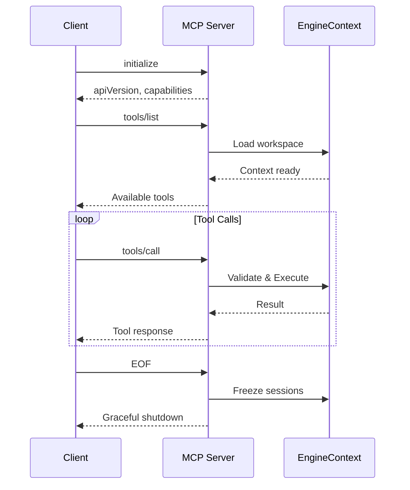

## Introduction

CURD implements the [Model Context Protocol (MCP)](https://modelcontextprotocol.io) as a JSON-RPC 2.0 server, enabling AI agents and external systems to interact with CURD's semantic code intelligence capabilities through a standardized interface.

The MCP server provides:

- **Semantic code search** across entire codebases (instant SQLite-backed AST queries)
- **Safe code editing** through transactional shadow workspaces
- **Graph-aware navigation** with dependency analysis
- **Session-based authentication** using Ed25519 cryptography
- **Plan execution** for complex multi-step workflows

## Server Modes

CURD's MCP server operates in two modes, controlled by the `CURD_MODE` environment variable:

<CodeGroup>
```bash Full Mode (Default)
export CURD_MODE=full
curd run --root /path/to/workspace
```

```bash Lite Mode
export CURD_MODE=lite
curd run --root /path/to/workspace
```
</CodeGroup>

### Full Mode

Provides unrestricted access to all MCP methods and CURD tools:

- All MCP methods: `initialize`, `tools/list`, `tools/call`
- All CURD tools: search, read, edit, graph, workspace, shell, debug, etc.
- Background execution and plan orchestration
- Full transaction and session management

### Lite Mode

Restricted environment for read-only or limited-write scenarios:

<Card title="Allowed Methods" icon="check">
  - `initialize`
  - `tools/list`
  - `tools/call`
</Card>

<Card title="Allowed Tools" icon="wrench">
  - `search` - AST and text search
  - `read` - Read files and symbols
  - `edit` - Safe AST-aware editing
  - `graph` - Dependency analysis
  - `workspace` - Transaction management
</Card>

<Warning>
In Lite mode, calls to disabled methods or tools return JSON-RPC error `-32601` (Method/Tool disabled).
</Warning>

## Protocol Version

CURD MCP server implements:

- **MCP Protocol Version**: `2024-11-05`
- **CURD API Version**: `0.7.1` (from `curd/src/mcp.rs:15`)
- **Transport**: stdio (JSON-RPC over stdin/stdout)
- **Content-Length Support**: Yes (HTTP-style headers for large payloads)

## Connection Lifecycle



### Initialization

The `initialize` method is intentionally lightweight to ensure instant boot:

<CodeGroup>
```json Request
{
  "jsonrpc": "2.0",
  "id": 1,
  "method": "initialize",
  "params": {}
}
```

```json Response
{
  "jsonrpc": "2.0",
  "id": 1,
  "result": {
    "apiVersion": "0.7.1",
    "protocolVersion": "2024-11-05",
    "capabilities": {
      "tools": {}
    },
    "serverInfo": {
      "name": "curd",
      "version": "0.1.0"
    }
  }
}
```
</CodeGroup>

<Info>
The `EngineContext` (workspace indexing) is initialized asynchronously after the first non-initialize request to keep boot time under 50ms.
</Info>

### Context Loading

After initialization, the first tool request triggers:

1. **Workspace Validation** - Checks for `.curd/settings.toml`
2. **EngineContext Creation** - Loads configuration and policy
3. **Indexing** (if needed) - Tree-sitter parses workspace AST
4. **Event Bridge** - Subscribes to system events for progress notifications

See `curd/src/mcp.rs:76-161` for implementation details.

## Transport Details

### Standard JSON-RPC

Default transport for small payloads:

```json
{"jsonrpc":"2.0","id":42,"method":"tools/call","params":{...}}\n
```

Each message is a single line terminated by `\n`.

### Content-Length Protocol

For payloads exceeding 10MB (rejected) or containing complex data:

```http
Content-Length: 1542

{"jsonrpc":"2.0","id":42,"method":"tools/call","params":{...}}
```

<Warning>
Payloads larger than 10MB are rejected with error: "Payload too large (max 10MB)"

See `curd/src/mcp.rs:118-121` for size limit enforcement.
</Warning>

## Progress Notifications

CURD emits real-time notifications during long-running operations:

### Indexing Progress

```json
{
  "jsonrpc": "2.0",
  "method": "notifications/progress",
  "params": {
    "event_id": "uuid",
    "session_id": "uuid",
    "phase": "indexing",
    "processed_files": 1523,
    "total_files": 3000,
    "percent": 50.77,
    "duration_ms": 2341,
    "summary": "Indexing: 1523/3000 files"
  }
}
```

### Stall Detection

If indexing stops making progress:

```json
{
  "jsonrpc": "2.0",
  "method": "notifications/progress",
  "params": {
    "phase": "stall_detected",
    "processed_files": 1523,
    "total_files": 3000,
    "no_progress_ms": 5000,
    "summary": "IndexStall: 1523/3000 files no_progress_ms=5000"
  }
}
```

### Index Statistics

```json
{
  "jsonrpc": "2.0",
  "method": "notifications/progress",
  "params": {
    "phase": "indexing_stats",
    "symbols": 45231,
    "edges": 123456,
    "files": 3000,
    "duration_ms": 8234
  }
}
```

See `curd/src/mcp.rs:310-389` for notification parsing logic.

## Graceful Shutdown

When the client closes stdin (EOF):

1. **Complete pending requests** - All spawned handlers finish
2. **Flush output** - Writer task drains message queue
3. **Freeze sessions** - Active authenticated sessions are persisted to disk
4. **Exit cleanly**

Session freezing ensures agents can resume work across MCP server restarts:

```rust
// From curd/src/mcp.rs:232-256
if let Err(e) = curd_core::auth::IdentityManager::freeze_session(
    &ctx.workspace_root,
    &entry.pubkey_hex,
    &entry.state,
) {
    log::error!("Failed to freeze session {}: {}", entry.pubkey_hex, e);
}
```

<Info>
Frozen sessions can be restored using `connection_verify` with the original public key.
</Info>

## Error Handling

All errors follow JSON-RPC 2.0 specification:

<ResponseField name="error" type="object">
  <Expandable title="properties">
    <ResponseField name="code" type="integer">
      Standard JSON-RPC error code:
      - `-32601`: Method not found / disabled
      - `-32000`: Internal/server error
    </ResponseField>
    <ResponseField name="message" type="string">
      Human-readable error description
    </ResponseField>
    <ResponseField name="details" type="object | null">
      Optional structured error context (tool name, capability, etc.)
    </ResponseField>
  </Expandable>
</ResponseField>

### Common Error Responses

<CodeGroup>
```json Method Disabled (Lite Mode)
{
  "jsonrpc": "2.0",
  "id": 5,
  "error": {
    "code": -32601,
    "message": "Method disabled: tools/call",
    "details": null
  }
}
```

```json Tool Disabled (Lite Mode)
{
  "jsonrpc": "2.0",
  "id": 5,
  "error": {
    "code": -32601,
    "message": "Tool disabled in current mode: shell",
    "details": null
  }
}
```

```json Server Initializing
{
  "jsonrpc": "2.0",
  "id": 5,
  "error": {
    "code": -32000,
    "message": "Server initializing",
    "details": null
  }
}
```
</CodeGroup>

See `curd/src/mcp.rs:1140-1179` for error normalization logic.

## Related Resources

<CardGroup cols={2}>
  <Card title="MCP Tools" icon="wrench" href="/api/tools/overview">
    Complete reference of available CURD tools
  </Card>
  <Card title="Session Management" icon="key" href="/api/mcp/session-management">
    Authentication and connection tokens
  </Card>
  <Card title="Settings Reference" icon="gear" href="/configuration/settings">
    Configure runtime modes and policies
  </Card>
  <Card title="Plan Execution" icon="diagram-project" href="/workflows/plan-artifacts">
    Multi-step workflow orchestration
  </Card>
</CardGroup>