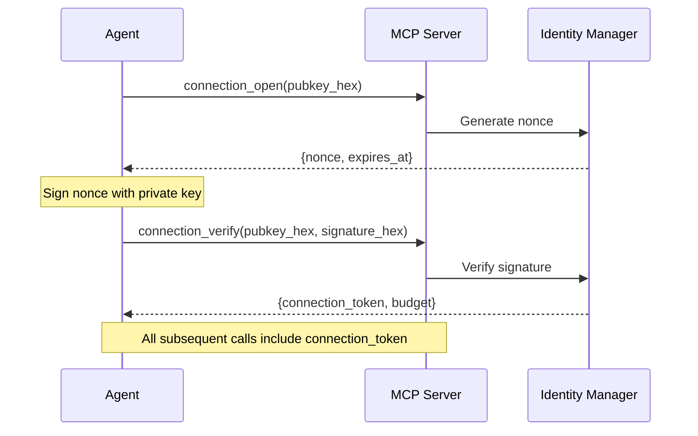
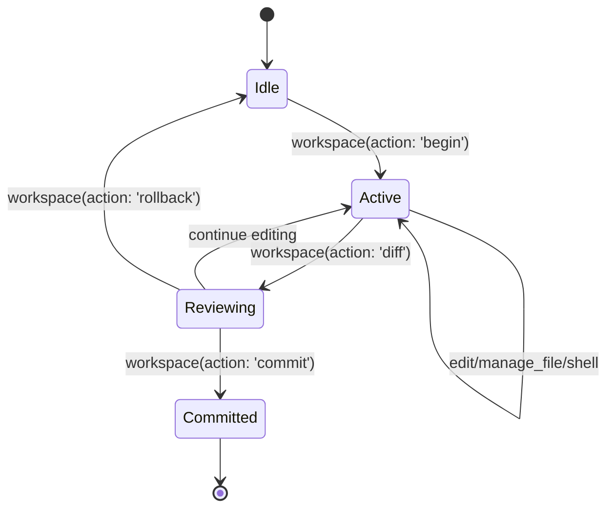

## Overview

CURD uses a two-tier session model:

1. **Connection Authentication** - Ed25519 cryptographic identity verification
2. **Workspace Sessions** - Transactional shadow workspace for safe mutations

<Warning>
**Critical Requirement**: Tools that mutate workspace state (`edit`, `manage_file`, `shell`, `execute_plan`) **REQUIRE** both:
- Valid `connection_token` (from authentication)
- Active workspace session (from `workspace(action: 'begin')`)

Failure results in error: "This tool requires an active workspace session."
</Warning>

## Connection Authentication

CURD uses Ed25519 public-key cryptography for stateless authentication:



### Step 1: Request Challenge

<CodeGroup>
```json connection_open Request
{
  "jsonrpc": "2.0",
  "id": 10,
  "method": "tools/call",
  "params": {
    "name": "connection_open",
    "arguments": {
      "pubkey_hex": "a1b2c3d4e5f6..." // Ed25519 public key (64 hex chars)
    }
  }
}
```

```json connection_open Response
{
  "jsonrpc": "2.0",
  "id": 10,
  "result": {
    "content": [
      {
        "type": "text",
        "text": "{\n  \"nonce\": \"f7e8d9c0b1a2...\",\n  \"expires_at\": 1678901234\n}"
      }
    ]
  }
}
```
</CodeGroup>

The nonce is a random 32-byte challenge that must be signed with the private key.

### Step 2: Verify Signature

<CodeGroup>
```json connection_verify Request
{
  "jsonrpc": "2.0",
  "id": 11,
  "method": "tools/call",
  "params": {
    "name": "connection_verify",
    "arguments": {
      "pubkey_hex": "a1b2c3d4e5f6...",
      "signature_hex": "9a8b7c6d5e4f..." // Ed25519 signature of nonce
    }
  }
}
```

```json connection_verify Response
{
  "jsonrpc": "2.0",
  "id": 11,
  "result": {
    "content": [
      {
        "type": "text",
        "text": "{\n  \"connection_token\": \"tok_abc123...\",\n  \"budget\": {\n    \"max_tokens\": 1000000,\n    \"max_time_secs\": 3600\n  }\n}"
      }
    ]
  }
}
```
</CodeGroup>

The `connection_token` must be included in all subsequent tool calls that require authentication.

### Using Connection Tokens

Include the token in tool call arguments:

```json
{
  "name": "edit",
  "arguments": {
    "connection_token": "tok_abc123...",
    "uri": "src/main.rs::main",
    "code": "...",
    "adaptation_justification": "Fix bug"
  }
}
```

<Info>
**Backward Compatibility**: The deprecated `session_token` parameter is still accepted as an alias for `connection_token`.

See `curd/src/mcp.rs:584-606` for deprecation notices.
</Info>

## Connection Budget (Stamina)

Each authenticated connection has resource limits:

<ResponseField name="budget" type="object">
  <Expandable title="properties">
    <ResponseField name="max_tokens" type="integer">
      Maximum token consumption (default: 1,000,000)
    </ResponseField>
    <ResponseField name="max_time_secs" type="integer">
      Maximum connection duration in seconds (default: 3600)
    </ResponseField>
    <ResponseField name="consumed_tokens" type="integer">
      Tokens consumed so far
    </ResponseField>
    <ResponseField name="elapsed_secs" type="integer">
      Connection age in seconds
    </ResponseField>
  </Expandable>
</ResponseField>

### Check Remaining Budget

```json
{
  "name": "stamina",
  "arguments": {}
}
```

Response:
```json
{
  "connection_token": "tok_abc123...",
  "budget": {
    "max_tokens": 1000000,
    "consumed_tokens": 42315,
    "remaining_tokens": 957685,
    "max_time_secs": 3600,
    "elapsed_secs": 127,
    "remaining_secs": 3473
  }
}
```

See `curd/src/mcp.rs:1119-1126` for the `stamina` tool definition.

<Tip>
Budget limits are configured in `settings.toml` under `[auth.budget]`. See [Settings Reference](/configuration/settings).
</Tip>

## Workspace Sessions

Workspace sessions provide transactional guarantees for code mutations:

### Session Lifecycle



### Begin Session

<CodeGroup>
```json Begin Workspace Session
{
  "name": "workspace",
  "arguments": {
    "action": "begin"
  }
}
```

```json Response
{
  "status": "active",
  "shadow_root": ".curd/shadow/root",
  "session_id": "uuid",
  "message": "Shadow workspace initialized"
}
```
</CodeGroup>

This creates a physical shadow workspace at `.curd/shadow/root` where all mutations are staged.

### Check Session Status

```json
{
  "name": "workspace",
  "arguments": {
    "action": "status"
  }
}
```

Response:
```json
{
  "status": "active",
  "edited_files": 5,
  "created_files": 2,
  "deleted_files": 1,
  "shadow_size_bytes": 124567
}
```

### Review Changes

```json
{
  "name": "workspace",
  "arguments": {
    "action": "diff"
  }
}
```

Returns unified diff of all staged changes.

### Pre-Commit Audit

<Warning>
**MANDATORY STEP**: Always run `verify_impact` before committing to detect regressions.
</Warning>

```json
{
  "name": "verify_impact",
  "arguments": {
    "connection_token": "tok_abc123...",
    "strict": true
  }
}
```

Response includes:
- **Cohesion analysis**: Are changes semantically consistent?
- **Broken link detection**: Any undefined references introduced?
- **Severity scores**: High/medium/low findings

See `curd/src/mcp.rs:607-617` for `verify_impact` tool definition.

### Commit Session

<CodeGroup>
```json Commit with Proposal
{
  "name": "workspace",
  "arguments": {
    "action": "commit",
    "proposal_id": "uuid",
    "max_high": 0,
    "max_medium": 5,
    "allow_high": false
  }
}
```

```json Commit Without Approval (Fast Local Iteration)
{
  "name": "workspace",
  "arguments": {
    "action": "commit",
    "allow_unapproved": true
  }
}
```
</CodeGroup>

**Commit Gates** (configurable in `settings.toml`):
- `proposal_id`: Requires pre-approved proposal (see `proposal` tool)
- `allow_unapproved`: Bypass proposal gate (for local dev)
- `max_high`/`max_medium`/`max_low`: Severity thresholds from `verify_impact`
- `allow_high`: Override high-severity gate

See `curd/src/mcp.rs:683-697` for workspace action definitions.

### Rollback Session

```json
{
  "name": "workspace",
  "arguments": {
    "action": "rollback"
  }
}
```

Discards all shadow changes and returns to idle state. Workspace files remain untouched.

## Session Persistence (Freezing)

When the MCP server shuts down gracefully (EOF on stdin), active sessions are frozen to disk:

1. **Latest session per pubkey** is identified
2. **Session state** (shadow store, metadata) is serialized
3. **Written** to `.curd/sessions/<pubkey_hex>.json`

On next `connection_verify`, the frozen session is restored, allowing agents to resume work.

See `curd/src/mcp.rs:232-256` for freeze hook implementation.

<Info>
**Use Case**: Long-running agent tasks that span multiple MCP server restarts (e.g., CI/CD pipelines, multi-hour refactoring jobs).
</Info>

## Session Requirements by Tool

Tools requiring active workspace session:

<CardGroup cols={2}>
  <Card title="Code Mutation" icon="pen-to-square">
    - `edit`
    - `manage_file`
    - `refactor`
  </Card>
  <Card title="Execution" icon="terminal">
    - `shell` (destructive commands)
    - `build`
  </Card>
  <Card title="Planning" icon="diagram-project">
    - `execute_plan` (if mutating)
    - `execute_dsl` (if mutating)
    - `execute_active_plan`
  </Card>
  <Card title="Proposals" icon="file-signature">
    - `proposal` (open/approve/reject)
  </Card>
</CardGroup>

See `curd/src/router.rs:66-80` for authoritative session requirement checks:

```rust
fn tool_requires_shadow_session(tool: &str) -> bool {
    matches!(
        tool,
        "edit"
            | "manage_file"
            | "mutate"
            | "proposal"
            | "refactor"
            | "shell"
            | "build"
            | "execute_plan"
            | "execute_active_plan"
            | "execute_dsl"
    )
}
```

## Error Scenarios

<AccordionGroup>
  <Accordion title="Missing Connection Token" icon="triangle-exclamation">
    ```json
    {
      "error": {
        "code": -32000,
        "message": "This tool requires authentication. Call connection_verify first.",
        "details": {
          "tool": "edit",
          "capability": "change.apply"
        }
      }
    }
    ```
  </Accordion>

  <Accordion title="No Active Session" icon="triangle-exclamation">
    ```json
    {
      "error": {
        "code": -32000,
        "message": "This tool requires an active workspace session. Call workspace(action: 'begin') first.",
        "details": {
          "tool": "edit",
          "session_status": "idle"
        }
      }
    }
    ```
  </Accordion>

  <Accordion title="Budget Exhausted" icon="triangle-exclamation">
    ```json
    {
      "error": {
        "code": -32000,
        "message": "Connection budget exhausted",
        "details": {
          "max_tokens": 1000000,
          "consumed_tokens": 1000142,
          "exceeded_by": 142
        }
      }
    }
    ```
  </Accordion>

  <Accordion title="Invalid Signature" icon="triangle-exclamation">
    ```json
    {
      "error": {
        "code": -32000,
        "message": "Signature verification failed",
        "details": {
          "pubkey_hex": "a1b2c3...",
          "nonce_expired": false
        }
      }
    }
    ```
  </Accordion>

  <Accordion title="Commit Gate Violation" icon="triangle-exclamation">
    ```json
    {
      "error": {
        "code": -32000,
        "message": "Commit gate failed: 3 high-severity findings exceed max_high=0",
        "details": {
          "findings": {
            "high": 3,
            "medium": 2,
            "low": 1
          },
          "thresholds": {
            "max_high": 0,
            "max_medium": 5
          }
        }
      }
    }
    ```
    
    **Solution**: Run `verify_impact`, fix issues, or set `allow_high: true` to override.
  </Accordion>
</AccordionGroup>

## Best Practices

<Steps>
  <Step title="Authenticate Once">
    Run `connection_open` + `connection_verify` at the start of your MCP session. Reuse the `connection_token` for all subsequent calls.
  </Step>
  
  <Step title="Begin Session Before Mutations">
    Always call `workspace(action: 'begin')` before any `edit`, `manage_file`, or `shell` calls.
  </Step>
  
  <Step title="Review Changes">
    Use `workspace(action: 'diff')` to inspect staged changes before committing.
  </Step>
  
  <Step title="Verify Impact">
    MANDATORY: Run `verify_impact(strict: true)` before `workspace(action: 'commit')` to catch regressions.
  </Step>
  
  <Step title="Commit with Gates">
    Use `max_high: 0` (or stricter) to enforce quality gates. Only bypass with `allow_unapproved` during rapid prototyping.
  </Step>
  
  <Step title="Check Budget Periodically">
    For long-running tasks, poll `stamina` to avoid hitting resource limits mid-operation.
  </Step>
</Steps>

## Example: Full Workflow

<CodeGroup>
```json 1. Authenticate
// Request challenge
{"name": "connection_open", "arguments": {"pubkey_hex": "..."}}

// Verify signature
{"name": "connection_verify", "arguments": {"pubkey_hex": "...", "signature_hex": "..."}}
// Receive: {"connection_token": "tok_abc123..."}
```

```json 2. Begin Session
{"name": "workspace", "arguments": {"action": "begin"}}
```

```json 3. Make Changes
{
  "name": "edit",
  "arguments": {
    "connection_token": "tok_abc123...",
    "uri": "src/app.rs::init",
    "code": "pub fn init() -> App { ... }",
    "adaptation_justification": "Add error handling"
  }
}
```

```json 4. Review Diff
{"name": "workspace", "arguments": {"action": "diff"}}
```

```json 5. Verify Impact
{
  "name": "verify_impact",
  "arguments": {
    "connection_token": "tok_abc123...",
    "strict": true
  }
}
```

```json 6. Commit
{
  "name": "workspace",
  "arguments": {
    "action": "commit",
    "allow_unapproved": true,
    "max_high": 0
  }
}
```
</CodeGroup>

## Related Resources

<CardGroup cols={2}>
  <Card title="MCP Protocol" icon="plug" href="/api/mcp/protocol">
    Server initialization and connection lifecycle
  </Card>
  <Card title="MCP Tools" icon="wrench" href="/api/tools/overview">
    Complete tool reference
  </Card>
  <Card title="Settings: Auth" icon="shield" href="/configuration/settings#auth">
    Configure budget limits and auth policies
  </Card>
  <Card title="Settings: Profiles" icon="user-gear" href="/configuration/settings#profiles">
    Define capability profiles for different use cases
  </Card>
</CardGroup>