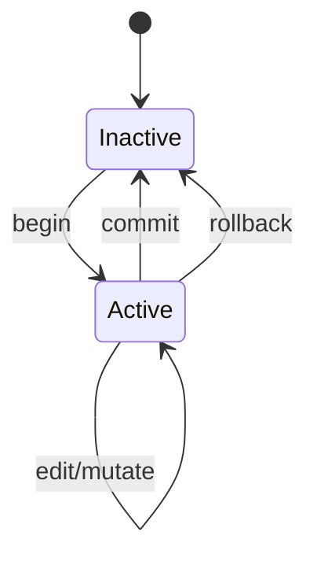

## Overview

The `session` command manages CURD's shadow workspace transactions. Sessions provide isolated, reviewable, and atomic code mutations with full rollback capability.

## Syntax

```bash
curd session [OPTIONS] <COMMAND>
```

**Alias:** `ses`

## Subcommands

### begin

Open a new shadow transaction.

```bash
curd session begin [--root PATH]
```

**Behavior:**
- Creates physical shadow workspace at `.curd/shadow/root/`
- Generates unique transaction ID (UUID)
- Enables edit operations (`curd edit`, refactors, plan execution)
- Prevents concurrent transactions (one active session per workspace)

**Example:**
```bash
curd session begin
# Started new shadow transaction.
```

---

### review

View changes and architectural impact of the current session.

```bash
curd session review [--root PATH]
```

**Output:**
```json
{
  "transaction_id": "abc123-def456-...",
  "state_hash": "5f7e3c2a...",
  "staged_files": [
    "src/main.rs",
    "src/api.rs"
  ],
  "diff_summary": {
    "additions": 42,
    "deletions": 18,
    "modifications": 3
  },
  "architectural_impact": {
    "new_cycles": [],
    "broken_links": 0,
    "symbols_added": 5,
    "symbols_removed": 2
  }
}
```

**Example:**
```bash
curd session review | jq '.staged_files'
```

---

### log

View detailed log of all tool calls and results in the current session.

```bash
curd session log [--root PATH]
```

**Output:**
```json
[
  {
    "timestamp_unix": 1710432890,
    "transaction_id": "abc123-def456-...",
    "operation": "edit",
    "input": {
      "uri": "src/main.rs::handle_request",
      "action": "upsert",
      "code": "pub fn handle_request() { }"
    },
    "output": {
      "message": "Symbol updated"
    }
  }
]
```

**Example:**
```bash
# View session history
curd session log | jq '.[].operation'

# Count operations
curd session log | jq 'length'
```

---

### commit

Commit the active shadow transaction to disk.

```bash
curd session commit [--root PATH]
```

**Behavior:**
- Performs conflict detection (three-way merge if needed)
- Writes all shadow changes to on-disk files
- Invalidates and rebuilds index
- Runs architectural audit
- Cleans up shadow workspace
- Ends the transaction

**Example:**
```bash
curd session commit
# Committed shadow changes to disk and ended review cycle.
```

**Conflict Handling:**
```bash
curd session commit
# Warning: Conflict detected in src/main.rs
# Attempting three-way merge...
# ✓ Auto-resolved conflict in src/main.rs:42
# ✓ Committed successfully.
```

---

### rollback

Discard the active shadow transaction.

```bash
curd session rollback [--root PATH]
```

**Behavior:**
- Deletes all shadow changes
- Cleans up shadow workspace
- Ends the transaction
- No changes written to disk

**Example:**
```bash
curd session rollback
# Discarded active shadow transaction and ended review cycle.
```

---

## Transaction Lifecycle



## Common Workflows

### Basic Edit Session

```bash
# 1. Start session
curd session begin

# 2. Make changes
curd edit src/api.rs::handler --action upsert --code 'pub fn handler() { }'

# 3. Review
curd session review

# 4. Commit
curd session commit
```

### Safe Experimentation

```bash
# Start session
curd session begin

# Try risky refactor
curd refactor rename User NewUser

# Test
curd test all

# If tests fail, rollback
curd session rollback

# If tests pass, commit
curd session commit
```

### Multi-Step Refactoring

```bash
curd session begin

# Step 1: Delete old API
curd edit src/old_api.rs::legacy_handler --action delete

# Step 2: Add new API
curd edit src/new_api.rs::modern_handler --action upsert --code '...'

# Step 3: Update callers
curd refactor rename old_api::legacy_handler new_api::modern_handler

# Review all changes
curd session review

# Check integrity
curd test all --verbose

# Commit atomically
curd session commit
```

### Inspect Before Commit

```bash
curd session begin

# Make edits...
curd edit src/lib.rs::foo --action upsert --code 'fn foo() { }'

# Review changes
curd session review

# Read modified files
curd read src/lib.rs::foo

# Check impact
curd graph src/lib.rs::foo

# View operation log
curd session log

# Decide: commit or rollback
curd session commit
```

## Session Requirements

Operations that **require an active session**:

- `curd edit` (all actions)
- `curd refactor` (rename, move, extract)
- Agent MCP tool calls: `edit`, `mutate`, `manage_file`
- `.curd` script execution with mutations
- Plan execution (`curd plan impl`)

**Without a session:**
```bash
curd edit src/main.rs::foo --action delete
# Error: No active shadow transaction. Run 'curd session begin' first.
```

## Conflict Resolution

When committing, CURD detects conflicts:

### Auto-Resolved

Non-overlapping changes are merged automatically:

```bash
curd session commit
# ✓ Auto-resolved conflict in src/main.rs
```

### Manual Resolution Required

Overlapping changes require manual intervention:

```bash
curd session commit
# Error: Cannot auto-resolve conflict in src/api.rs:42
# Manual intervention required.

# Option 1: Fix manually and commit
vim src/api.rs
git add src/api.rs
curd session commit

# Option 2: Rollback and retry
curd session rollback
```

## Session State

Check session state via `curd status`:

```bash
curd status

# Output:
[Shadow Store: ACTIVE]
  Staged Files:
    - src/main.rs
    - src/api.rs
  
  Run `curd session commit` to apply.
```

Or:

```bash
curd status

# Output:
[Shadow Store: INACTIVE]
  No active transaction.
```

## Architectural Impact Analysis

On commit, CURD analyzes changes:

```bash
curd session commit

# Output:
# Analyzing architectural impact...
# 
# [Impact Summary]
#   New Symbols:      5
#   Removed Symbols:  2
#   Modified Symbols: 3
#   New Cycles:       0
#   Broken Links:     0
#   Cohesion Ratio:   94%
# 
# ✓ No architectural regressions detected.
# ✓ Committed successfully.
```

If regressions detected:

```bash
curd session commit

# Output:
# [Impact Summary]
#   New Cycles:       1
#   Broken Links:     3
# 
# ⚠️  Warning: Architectural quality decreased.
# Continue? [y/N]: _
```

## Performance Notes

- `begin`: Instant (creates directory)
- `review`: Fast (&lt;100ms for small changes)
- `log`: Fast (reads trace files)
- `commit`: Depends on change size (index rebuild)
- `rollback`: Instant (deletes shadow dir)

## Troubleshooting

<AccordionGroup>
  <Accordion title="Session already active">
    Only one session allowed per workspace:
    ```bash
    curd session begin
    # Error: Shadow transaction already active.
    
    # Option 1: Commit existing
    curd session commit
    
    # Option 2: Rollback existing
    curd session rollback
    ```
  </Accordion>

  <Accordion title="No active session to commit">
    Start a session first:
    ```bash
    curd session commit
    # Error: No active shadow transaction to commit.
    
    curd session begin
    # Now you can make edits and commit
    ```
  </Accordion>

  <Accordion title="Commit fails with conflicts">
    Resolve conflicts manually:
    ```bash
    # View conflicting files
    curd session review
    
    # Option 1: Fix conflicts
    vim src/conflicted_file.rs
    curd session commit
    
    # Option 2: Discard and start over
    curd session rollback
    ```
  </Accordion>

  <Accordion title="Review shows unexpected files">
    The shadow includes all edits since `begin`:
    ```bash
    # View operation history
    curd session log
    
    # If unexpected, rollback and retry
    curd session rollback
    ```
  </Accordion>
</AccordionGroup>

## See Also

- [curd edit](/commands/edit) - Mutate symbols
- [curd refactor](/commands/refactor) - Structural transformations
- [curd status](/commands/workspace) - Check session state
- [curd test](/commands/test) - Verify integrity