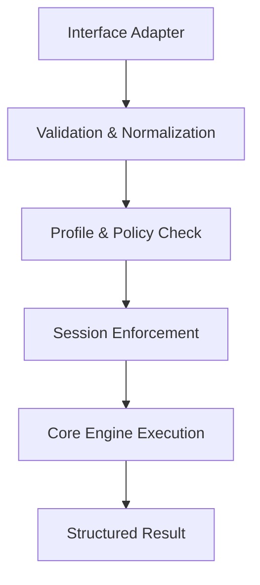

CURD is built as a **code-intelligence control plane** with four distinct architectural layers. Each layer serves a specific purpose in the workflow from understanding code to safely mutating it in a governed manner.

## The Four-Layer Architecture

CURD's architecture is designed to keep the source layer readable while making the execution layer explicit. This separation enables both fast local workflows and enterprise-grade governance.

<CardGroup cols={2}>
  <Card title="Code Intelligence" icon="magnifying-glass" href="/concepts/code-intelligence">
    Structural understanding through search, graph, and read
  </Card>
  <Card title="Safe Mutation" icon="shield-check">
    Shadow workspace sessions for risk-free code changes
  </Card>
  <Card title="Authoring" icon="file-code">
    Human-readable `.curd` scripts for workflow definition
  </Card>
  <Card title="Governed Execution" icon="lock">
    Compiled plan artifacts with profiles and policy
  </Card>
</CardGroup>

## Layer 1: Code Intelligence

The foundation layer provides **structural understanding** of your codebase, not just textual matching.

<CodeGroup>
```bash Search for symbols
curd search alpha
```

```bash Read specific code
curd read src/lib.rs::alpha
```

```bash Analyze impact
curd graph src/lib.rs::alpha --direction both --depth 2
```
</CodeGroup>

### Core Engines

<AccordionGroup>
  <Accordion title="SearchEngine" icon="magnifying-glass">
    - **BM25/FTS-backed ranked search** for fast symbol discovery
    - Tree-sitter-powered parsing for semantic accuracy
    - Incremental indexing with cache invalidation
    - Supports `lite` and `full` runtime modes
    
    Located in `curd-core/src/search.rs`
  </Accordion>
  
  <Accordion title="ReadEngine" icon="book-open">
    - URI-based reads with context-aware resolution
    - Symbol-level and file-level verbosity control
    - Shadow workspace support for reading modified state
    - Context registry integration for linked workspaces
    
    Located in `curd-core/src/read.rs`
  </Accordion>
  
  <Accordion title="GraphEngine" icon="network-wired">
    - Dependency and call graph construction
    - Bidirectional traversal with configurable depth
    - Edge metadata with confidence scoring
    - Cycle detection and integrity reporting
    - Topological sorting for dependency ordering
    
    Located in `curd-core/src/graph.rs`
  </Accordion>
</AccordionGroup>

### Why This Matters

Most coding tools treat code as plain text. CURD understands:
- Where symbols are defined and used
- How functions call each other
- What modules depend on what
- The structural impact of changes

This structural understanding is what makes safe, intelligent mutation possible.

## Layer 2: Safe Mutation

The safety layer ensures **all mutations happen in shadow workspaces** before touching your actual code.

<Steps>
  <Step title="Begin a Session">
    ```bash
    curd workspace begin
    ```
    Creates a shadow workspace at `.curd/shadow/<uuid>/root`
  </Step>
  
  <Step title="Make Changes">
    ```bash
    curd edit src/lib.rs::alpha --code "pub fn alpha() {}"
    ```
    All edits execute against the shadow workspace
  </Step>
  
  <Step title="Review Impact">
    ```bash
    curd workspace diff
    ```
    Inspect all staged changes before committing
  </Step>
  
  <Step title="Commit or Rollback">
    ```bash
    curd workspace commit  # Apply changes
    # OR
    curd workspace rollback  # Discard changes
    ```
  </Step>
</Steps>

### Shadow Workspace Transaction Model

The `ShadowStore` (in `curd-core/src/transaction.rs`) implements a deterministic transaction system:

```rust
pub struct ShadowStore {
    pub workspace_root: PathBuf,
    pub shadow_root: Option<PathBuf>,
    active: bool,
    staged_files: HashSet<PathBuf>,
    base_hashes: HashMap<PathBuf, String>,
    shadow_meta: HashMap<PathBuf, ShadowFileMeta>,
    savepoints: Vec<Savepoint>,
}
```

<Note>
**Transaction Guarantees:**
- All mutations are isolated in `.curd/shadow/<uuid>/root`
- Base file hashes prevent undetected conflicts
- Three-way merge via `git merge-file` for conflict resolution
- Atomic commit with conflict detection
- Complete rollback without touching workspace files
</Note>

### Mandatory Session Requirements

<Warning>
**Session Enforcement:**

Agents and automation **MUST** open a workspace session before any mutation:
- Direct mutation tools (`edit`, `mutate`, `manage_file`)
- Mutating DSL execution
- Mutating plan execution
- Destructive shell commands

Failure to open a session results in a barrier error.
</Warning>

## Layer 3: Authoring

The authoring layer provides **human-readable workflow scripts** in the `.curd` format.

### Script Syntax

```curd
# explain: tighten auth validation without changing the public API
# why: downstream callers depend on the current function name
# risk: auth and session modules are tightly connected
# review: Verify no hardcoded token assumptions remain

use session required
use profile supervised

arg target_uri: string = "src/auth.rs::validate"
arg strict: bool = true

let patch = """
pub fn validate(token: &str) -> bool {
    !token.is_empty() && token.len() >= 8
}
"""

atomic {
  edit uri=$target_uri action="upsert" code=$patch
  verify_impact strict=$strict
}
```

### Supported Constructs

<CardGroup cols={2}>
  <Card title="Directives">
    - `use profile <name>`
    - `use session required`
  </Card>
  <Card title="Variables">
    - `arg <name>: <type>`
    - `let <name> = <value>`
  </Card>
  <Card title="Control Flow">
    - `sequence { ... }`
    - `atomic { ... }`
    - `abort <message>`
  </Card>
  <Card title="Explainability">
    - `# explain:` - What this does
    - `# why:` - Justification
    - `# risk:` - Known risks
    - `# review:` - Review guidance
    - `# tag:` - Categorization
  </Card>
</CardGroup>

### Authoring Workflow

<Steps>
  <Step title="Write the Script">
    Create a `.curd` file with your workflow logic
  </Step>
  
  <Step title="Check Impact">
    ```bash
    curd run check fix_auth.curd
    ```
    Reports graph impact, conflicts, and safeguard suggestions
  </Step>
  
  <Step title="Compile to Plan">
    ```bash
    curd run compile fix_auth.curd --target-uri src/auth.rs::validate
    ```
    Generates a governed execution artifact
  </Step>
  
  <Step title="Edit Plan Defaults">
    ```bash
    curd plan edit <plan-id>
    ```
    Adjust profile, retry limits, and output budgets
  </Step>
</Steps>

<Info>
`.curd` scripts are **source files** for authoring intent. They compile into **plan artifacts** for governed execution. This separation keeps authoring readable while making execution inspectable.
</Info>

## Layer 4: Governed Execution

The execution layer provides **profile-based capability gating** and **compiled plan artifacts** for repeatable, auditable execution.

### Runtime Ceilings

CURD has two runtime ceilings that define the outer boundary of what's possible:

<Tabs>
  <Tab title="full">
    Exposes the complete implemented surface:
    - All workspace operations
    - All code intelligence tools
    - Build adapters and shell execution
    - Plugin management
    - Plan compilation and execution
  </Tab>
  
  <Tab title="lite">
    Intentionally restrictive, allows only:
    - `workspace` (status, list, dependencies only)
    - `search`
    - `read`
    - `edit`
    - `graph`
    - Protocol basics
  </Tab>
</Tabs>

### Profile-Based Capability Gating

Profiles in `settings.toml` define actual behavior within the runtime ceiling:

```toml
[runtime]
ceiling = "full"

[profiles.assist]
role = "assist_agent"
capabilities = ["lookup", "read"]
session_required_for_change = true
promotion = "forbidden"

[profiles.supervised]
role = "supervised_agent"
capabilities = [
  "lookup", "traverse", "read",
  "change.apply", "session.begin", "session.verify",
  "exec.task", "plan.execute", "review.run"
]
session_required_for_change = true
promotion = "approval_required"

[profiles.autonomous]
role = "autonomous_agent"
capabilities = [
  "lookup", "traverse", "read", "change.apply",
  "session.begin", "session.commit",
  "exec.command", "plan.execute", "plugin.use"
]
session_required_for_change = true
promotion = "automatic"
```

### Effective Permission Model

<Steps>
  <Step title="Runtime Ceiling">
    Defines the outer boundary of what the binary can do
  </Step>
  
  <Step title="Profile Capabilities">
    Gates what the specific actor is allowed to do
  </Step>
  
  <Step title="Policy Enforcement">
    Can still deny requests based on blocklists, allowlists, and constraints
  </Step>
</Steps>

<Warning>
A profile cannot exceed the runtime ceiling. If `ceiling = "lite"`, even an `autonomous` profile is restricted to the lite toolset.
</Warning>

### Plan Artifacts

Compiled plans are stored in `.curd/plans/<id>.json` and contain:

```json
{
  "id": "plan-abc123",
  "source_hash": "sha256:...",
  "source_path": "workflows/fix_auth.curd",
  "bound_arguments": {
    "target_uri": "src/auth.rs::validate",
    "strict": true
  },
  "metadata": {
    "explain": "tighten auth validation without changing the public API",
    "why": "downstream callers depend on the current function name",
    "risk": "auth and session modules are tightly connected",
    "tags": ["security", "refactor"]
  },
  "safeguards": {
    "retry_limit": 2,
    "output_limit": 4096,
    "requires_session": true
  },
  "nodes": [ /* compiled DSL nodes */ ]
}
```

## Component Architecture

CURD is split into multiple Rust crates with clear separation of concerns:

### `curd-core`

Authoritative business logic and core engines:

<CardGroup cols={2}>
  <Card title="Engines">
    - `SearchEngine` - BM25/FTS indexing
    - `ReadEngine` - URI-based reads
    - `EditEngine` - Symbol mutations
    - `GraphEngine` - Dependency graphs
    - `WorkspaceEngine` - Session management
    - `PlanRuntime` - DSL execution
  </Card>
  <Card title="Support">
    - `transaction.rs` - Shadow store
    - `graph_audit.rs` - Integrity alerts
    - `sandbox.rs` - Containerized execution
    - `policy.rs` - Blocklist/allowlist
    - `plugin_packages.rs` - `.curdl`/`.curdt`
  </Card>
</CardGroup>

### `curd`

Control plane, routing, and transport adapters:

- CLI argument parsing
- Shared tool routing and validation (`router.rs`, `validation.rs`)
- MCP server implementation (`mcp.rs`)
- Interactive REPL (`repl.rs`)

<Note>
Heavy handlers run on `spawn_blocking` to avoid blocking Tokio worker threads.
</Note>

### Bindings and Extensions

<CardGroup cols={2}>
  <Card title="Language Bindings">
    - `curd-python` - Thin Python wrapper
    - `curd-node` - Thin Node.js wrapper
  </Card>
  <Card title="Plugin System">
    - `.curdl` - Language ecosystem packages
    - `.curdt` - Native tool packages
  </Card>
</CardGroup>

## Control Plane Consistency

<Info>
**One Control Plane, Multiple Interfaces:**

All interfaces (CLI, REPL, MCP, CODEX, GPUI) route through the same validation and execution layer. No interface gets special mutation privileges or bypasses.
</Info>

The canonical flow:



### Why This Architecture Scales

<CardGroup cols={2}>
  <Card title="For Indie Developers" icon="user">
    - Repeatable safe workflows
    - Better code understanding
    - No ceremony for simple tasks
    - Light defaults with opt-in governance
  </Card>
  <Card title="For Engineering Teams" icon="users">
    - One execution model
    - Profile-based capability gating
    - Session-based mutation tracking
    - Inspectable plan artifacts
    - Clear approval boundaries
  </Card>
</CardGroup>

## Design Principles

<AccordionGroup>
  <Accordion title="Structural Over Textual" icon="sitemap">
    CURD understands code structure via Tree-sitter, not regex patterns. This enables semantic-aware mutations and reliable impact analysis.
  </Accordion>
  
  <Accordion title="Safety by Default" icon="shield">
    All mutations require explicit workspace sessions. Shadow workspaces isolate changes until explicitly committed.
  </Accordion>
  
  <Accordion title="Explicit Over Implicit" icon="eye">
    Authoring (`.curd` scripts) is separate from execution (plan artifacts). Governance happens at the compilation boundary.
  </Accordion>
  
  <Accordion title="Consistent Control Plane" icon="network-wired">
    All interfaces route through the same validation, profile checks, and policy enforcement. No bypass lanes.
  </Accordion>
</AccordionGroup>

## Next Steps

<CardGroup cols={2}>
  <Card title="Code Intelligence" icon="magnifying-glass" href="/concepts/code-intelligence">
    Deep dive into search, graph, and read engines
  </Card>
  <Card title="Shadow Workspace" icon="clone" href="/concepts/shadow-workspace">
    Learn the transaction model and session lifecycle
  </Card>
  <Card title="Profiles & Runtime" icon="id-card" href="/concepts/profiles-and-runtime">
    Understand capability gating and execution modes
  </Card>
  <Card title="Getting Started" icon="rocket" href="/quickstart">
    Try your first CURD workflow
  </Card>
</CardGroup>