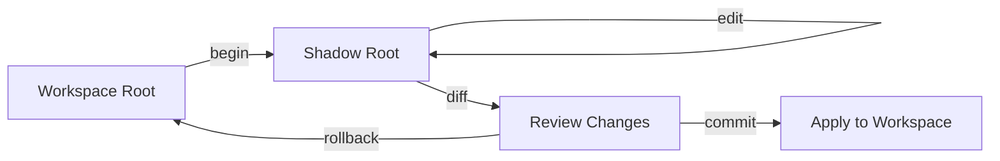

The Shadow Workspace is CURD's **transaction system** for code mutations. All changes happen in an isolated shadow copy of your workspace, allowing you to review, test, and validate before committing to the real workspace.

## Why Shadow Workspaces?

<CardGroup cols={2}>
  <Card title="Safety" icon="shield-check">
    - Changes are isolated from your real code
    - No risk of breaking your workspace
    - Complete rollback without side effects
  </Card>
  <Card title="Determinism" icon="check-circle">
    - Conflict detection via base hashes
    - Three-way merge on conflicts
    - Atomic commits
    - Repeatable transactions
  </Card>
</CardGroup>

<Warning>
**Mandatory for All Mutations:**

Agents and automation **MUST** open a workspace session before:
- Direct mutation tools (`edit`, `mutate`, `manage_file`)
- Mutating DSL execution
- Mutating plan execution
- Destructive shell commands

Attempting mutations without a session results in a barrier error.
</Warning>

## Transaction Model

The shadow workspace implements a deterministic transaction model similar to database transactions:



### ShadowStore Structure

Implemented in `curd-core/src/transaction.rs`:

```rust
pub struct ShadowStore {
    pub workspace_root: PathBuf,
    pub shadow_root: Option<PathBuf>,
    active: bool,
    staged_files: HashSet<PathBuf>,
    base_hashes: HashMap<PathBuf, String>,
    shadow_meta: HashMap<PathBuf, ShadowFileMeta>,
    savepoints: Vec<Savepoint>,
}
```

<AccordionGroup>
  <Accordion title="workspace_root" icon="folder">
    The canonical workspace directory (your actual code)
  </Accordion>
  
  <Accordion title="shadow_root" icon="clone">
    The isolated transaction directory: `.curd/shadow/<uuid>/root`
  </Accordion>
  
  <Accordion title="staged_files" icon="file-circle-check">
    Set of relative paths modified during the transaction
  </Accordion>
  
  <Accordion title="base_hashes" icon="fingerprint">
    SHA-256 hashes of files at transaction start (for conflict detection)
  </Accordion>
  
  <Accordion title="shadow_meta" icon="info-circle">
    Metadata snapshot (size, mtime) for each file in the shadow workspace
  </Accordion>
  
  <Accordion title="savepoints" icon="bookmark">
    Stack of nested transaction savepoints (for atomic blocks)
  </Accordion>
</AccordionGroup>

## Session Lifecycle

<Steps>
  <Step title="Begin Transaction">
    ```bash
    curd workspace begin
    ```
    
    Creates:
    - Shadow directory: `.curd/shadow/<uuid>/root`
    - Selective file copy (not full clone)
    - Base hash snapshot
    - HEAD manifest at `.curd/shadow/HEAD`
  </Step>
  
  <Step title="Make Changes">
    ```bash
    curd edit src/lib.rs::alpha --code "pub fn alpha() {}"
    ```
    
    All edits apply to shadow workspace:
    - File modifications staged automatically
    - Build commands run in shadow context
    - Read operations return shadow state
  </Step>
  
  <Step title="Review Changes">
    ```bash
    curd workspace diff
    ```
    
    Shows:
    - All staged files
    - Unified diff for each change
    - Shadow workspace path
  </Step>
  
  <Step title="Commit or Rollback">
    ```bash
    curd workspace commit  # Apply changes
    # OR
    curd workspace rollback  # Discard changes
    ```
    
    **Commit**:
    - Conflict detection (base hash check)
    - Three-way merge if needed
    - Atomic copy back to workspace
    - Clean up shadow directory
    
    **Rollback**:
    - Remove shadow directory
    - Clear staged files
    - No workspace changes
  </Step>
</Steps>

## Shadow Workspace Operations

### Begin

Starts a new transaction:

<Tabs>
  <Tab title="CLI">
    ```bash
    curd workspace begin
    ```
  </Tab>
  
  <Tab title="MCP">
    ```json
    {
      "tool": "workspace",
      "arguments": {
        "action": "begin"
      }
    }
    ```
  </Tab>
  
  <Tab title="REPL">
    ```
    > workspace begin
    ```
  </Tab>
</Tabs>

**What Happens:**

1. Generate UUID for transaction
2. Create `.curd/shadow/<uuid>/root`
3. Selective copy of workspace files (lazy - copy on first access)
4. Snapshot base hashes for all tracked files
5. Write HEAD manifest with transaction state

<Info>
**Lazy Copy Optimization:**

Files are copied to shadow workspace only when:
- They are explicitly edited
- They are dependencies of edited files
- A build command needs them

This makes `begin` nearly instant for large workspaces.
</Info>

### Status

Check current transaction state:

```bash
curd workspace status
```

**Response:**

```json
{
  "active": true,
  "shadow_root": "/path/to/.curd/shadow/abc-123-def/root",
  "staged_files": [
    "src/lib.rs",
    "src/auth.rs"
  ],
  "base_hashes": {
    "src/lib.rs": "sha256:abc123...",
    "src/auth.rs": "sha256:def456..."
  }
}
```

### Diff

View all staged changes:

<CodeGroup>
```bash Basic Diff
curd workspace diff
```

```bash Diff Specific File
curd workspace diff --file src/lib.rs
```

```bash Diff with Context
curd workspace diff --unified 5
```
</CodeGroup>

**Output:**

```diff
--- a/src/lib.rs
+++ b/src/lib.rs
@@ -45,7 +45,9 @@
 pub fn alpha() {
-    println!("old");
+    println!("new");
+    validate_input();
 }
```

### Commit

Apply changes to real workspace:

```bash
curd workspace commit
```

**Commit Process:**

<Steps>
  <Step title="Conflict Detection">
    For each staged file:
    - Hash current workspace version
    - Compare to `base_hashes[file]`
    - If mismatch → conflict detected
  </Step>
  
  <Step title="Conflict Resolution">
    If conflicts found:
    ```bash
    git merge-file \
      shadow/file \
      base/file \
      workspace/file
    ```
    Three-way merge attempts automatic resolution
  </Step>
  
  <Step title="Atomic Copy">
    For each staged file:
    - Copy from shadow to workspace
    - Preserve file permissions
    - Update mtime
  </Step>
  
  <Step title="Cleanup">
    - Remove shadow directory
    - Clear HEAD manifest
    - Invalidate search/graph caches
  </Step>
</Steps>

<Warning>
**Conflict Handling:**

If three-way merge fails, commit is aborted and you must:
1. Review conflicts manually
2. Use `workspace rollback` to discard
3. Start a fresh transaction with updated base
</Warning>

### Rollback

Discard all changes:

```bash
curd workspace rollback
```

**Rollback Process:**

1. Remove entire shadow directory tree
2. Clear `staged_files` set
3. Clear `base_hashes` map
4. Remove HEAD manifest
5. **No changes to workspace root**

<Info>
Rollback is **instant and safe**. It never touches your real workspace.
</Info>

## Advanced Features

### Savepoints (Nested Transactions)

CURD supports nested transaction blocks using savepoints:

```curd
atomic {
  edit uri="src/lib.rs::alpha" code="..."
  atomic {
    edit uri="src/helper.rs::beta" code="..."
    # If this fails, only inner atomic block rolls back
  }
}
```

**Implementation:**

```rust
pub fn savepoint(&mut self) -> Result<()> {
    self.savepoints.push(Savepoint {
        staged_files: self.staged_files.clone(),
        base_hashes: self.base_hashes.clone(),
    });
    Ok(())
}

pub fn rollback_to_savepoint(&mut self) -> Result<()> {
    if let Some(sp) = self.savepoints.pop() {
        self.staged_files = sp.staged_files;
        self.base_hashes = sp.base_hashes;
    }
    Ok(())
}
```

### Transaction Recovery

If CURD crashes mid-transaction:

```rust
fn load_head(&mut self) {
    let head = self.head_path();
    if head.exists() {
        if let Ok(state) = serde_json::from_str::<TransactionState>(&json) {
            // Recover shadow_root, staged_files, base_hashes
            log::info!("Recovered active shadow workspace transaction: {}", state.active_uuid);
        }
    }
}
```

<Note>
**Automatic Recovery:**

Next `curd` invocation automatically:
1. Reads `.curd/shadow/HEAD`
2. Validates shadow directory exists
3. Restores transaction state
4. Allows you to commit or rollback
</Note>

### Manual Intervention

For debugging or manual inspection:

```bash
# View shadow workspace directly
ls .curd/shadow/<uuid>/root

# Run commands in shadow context
cd .curd/shadow/<uuid>/root
cargo test

# Compare with workspace
diff -r .curd/shadow/<uuid>/root src/ src/
```

## Integration with Edit Engine

The `EditEngine` (in `curd-core/src/edit.rs`) automatically uses shadow workspace when active:

```rust
pub fn edit(
    &self,
    uri: &str,
    code: &str,
    action: &str,
    base_state_hash: Option<&str>,
    cwd_override: Option<&Path>,  // Shadow root passed here
) -> Result<Value>
```

**Workflow:**

1. Check if shadow session is active
2. If yes, pass `shadow_root` as `cwd_override`
3. Perform edit in shadow workspace
4. Mark file as staged
5. Return result

<Warning>
**Session Lock:**

If a shadow workspace is active and you try to edit without passing `cwd_override`, you'll get:

```
Cannot edit 'src/lib.rs::alpha': Workspace is locked by another active session.
Open a CURD session or close the existing one.
```
</Warning>

## Integration with Shell/Build Commands

When a shadow workspace is active, shell and build commands execute in shadow context:

```bash
curd workspace begin
curd shell "cargo test"  # Runs in .curd/shadow/<uuid>/root
curd build --adapter cargo  # Builds shadow workspace
```

**Sandbox Configuration:**

The `Sandbox` (in `curd-core/src/sandbox.rs`) respects shadow workspace:

```rust
pub fn shell(
    &self,
    command: &str,
    cwd: Option<&Path>,  // Defaults to shadow_root if active
    background: bool,
) -> Result<ShellResult>
```

## Profile and Policy Enforcement

Workspace operations respect profile capabilities:

<Tabs>
  <Tab title="assist">
    ```toml
    [profiles.assist]
    capabilities = ["lookup", "read"]
    session_required_for_change = true
    ```
    
    **Cannot**:
    - Begin sessions
    - Commit changes
  </Tab>
  
  <Tab title="supervised">
    ```toml
    [profiles.supervised]
    capabilities = [
      "lookup", "read", "change.apply",
      "session.begin", "session.verify"
    ]
    ```
    
    **Can**:
    - Begin sessions
    - Make edits
    - Review diffs
    
    **Cannot**:
    - Commit without approval
  </Tab>
  
  <Tab title="autonomous">
    ```toml
    [profiles.autonomous]
    capabilities = [
      "lookup", "read", "change.apply",
      "session.begin", "session.commit"
    ]
    ```
    
    **Full access** to all workspace operations
  </Tab>
</Tabs>

## Best Practices

<AccordionGroup>
  <Accordion title="Always Use Sessions for Mutations" icon="shield">
    Never mutate files directly. Always wrap in `workspace begin` / `commit` or `rollback`.
    
    ```bash
    # Good
    curd workspace begin
    curd edit src/lib.rs::fn --code "..."
    curd workspace commit
    
    # Bad (will error)
    curd edit src/lib.rs::fn --code "..."
    ```
  </Accordion>
  
  <Accordion title="Review Before Committing" icon="eye">
    Always run `workspace diff` to understand what will change:
    
    ```bash
    curd workspace begin
    curd run my_changes.curd
    curd workspace diff  # Review
    curd workspace commit
    ```
  </Accordion>
  
  <Accordion title="Test in Shadow Before Committing" icon="flask">
    Run tests against shadow workspace to validate changes:
    
    ```bash
    curd workspace begin
    curd edit src/lib.rs::fn --code "..."
    curd shell "cargo test"
    curd workspace commit
    ```
  </Accordion>
  
  <Accordion title="Use Atomic Blocks for Multi-File Changes" icon="cubes">
    Ensure all-or-nothing semantics:
    
    ```curd
    atomic {
      edit uri="src/lib.rs::fn" code="..."
      edit uri="src/helper.rs::util" code="..."
      # Both succeed or both rollback
    }
    ```
  </Accordion>
</AccordionGroup>

## Debugging Transactions

### Check Active Sessions

```bash
curd workspace status
```

### Inspect Shadow Files

```bash
ls -la .curd/shadow/
cat .curd/shadow/HEAD
```

### Force Cleanup

If a session is stuck:

```bash
rm -rf .curd/shadow/
```

<Warning>
Force cleanup discards all transaction state. Only use if recovery fails.
</Warning>

## Performance Considerations

<CardGroup cols={2}>
  <Card title="Begin Time">
    - Lazy copy: **&lt;10ms**
    - Creates directory structure
    - No file copies until needed
  </Card>
  <Card title="Commit Time">
    - Conflict check: **~5ms/file**
    - Copy back: **~10ms/file**
    - Cache invalidation: **~50ms**
  </Card>
  <Card title="Diff Time">
    - Compute diffs: **~20ms/file**
    - Uses native `diff` utility
    - Cached after first call
  </Card>
  <Card title="Rollback Time">
    - Remove directory: **~50ms**
    - No workspace operations
    - Instant for large transactions
  </Card>
</CardGroup>

## API Access

All workspace operations are available via:

<Tabs>
  <Tab title="CLI">
    ```bash
    curd workspace begin
    curd workspace status
    curd workspace diff
    curd workspace commit
    curd workspace rollback
    ```
  </Tab>
  
  <Tab title="MCP">
    ```json
    {"tool": "workspace", "arguments": {"action": "begin"}}
    {"tool": "workspace", "arguments": {"action": "status"}}
    {"tool": "workspace", "arguments": {"action": "diff"}}
    {"tool": "workspace", "arguments": {"action": "commit"}}
    {"tool": "workspace", "arguments": {"action": "rollback"}}
    ```
  </Tab>
  
  <Tab title="REPL">
    ```
    > workspace begin
    > workspace status
    > workspace diff
    > workspace commit
    > workspace rollback
    ```
  </Tab>
</Tabs>

## Next Steps

<CardGroup cols={2}>
  <Card title="Code Intelligence" icon="magnifying-glass" href="/concepts/code-intelligence">
    Learn how to explore code before making changes
  </Card>
  <Card title="Profiles & Runtime" icon="id-card" href="/concepts/profiles-and-runtime">
    Understand session capabilities and permissions
  </Card>
  <Card title="Architecture" icon="sitemap" href="/concepts/architecture">
    See how shadow workspace fits in the overall architecture
  </Card>
  <Card title="Getting Started" icon="rocket" href="/quickstart">
    Try your first safe mutation workflow
  </Card>
</CardGroup>